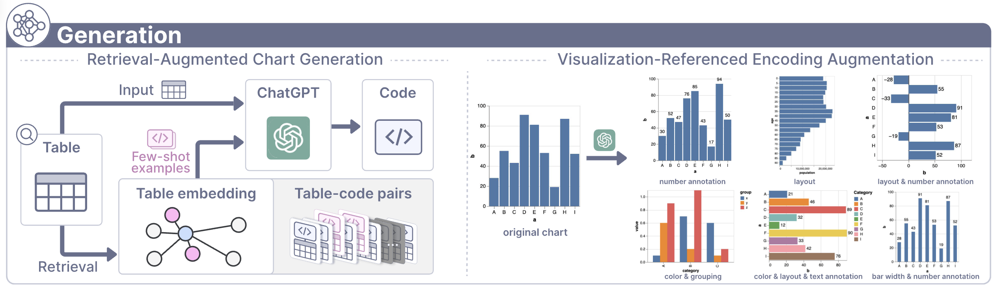
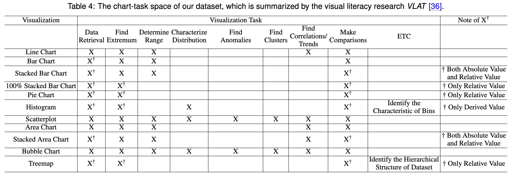
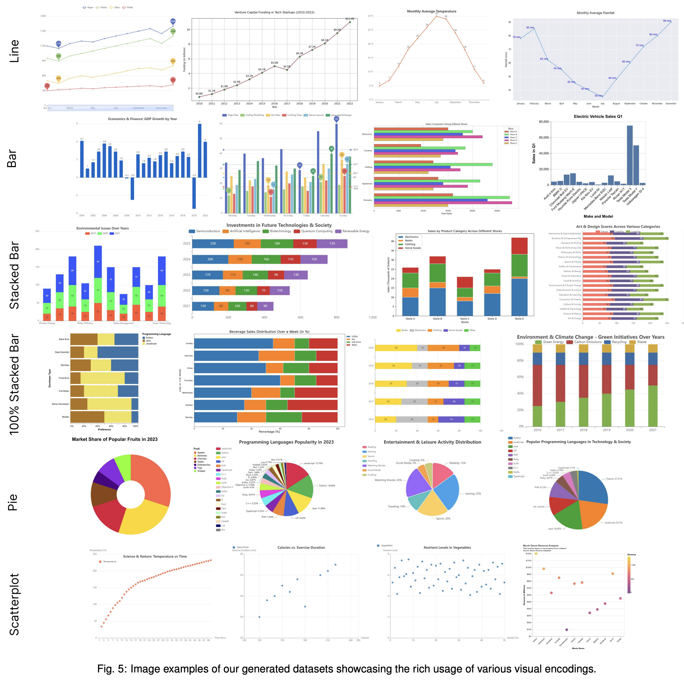
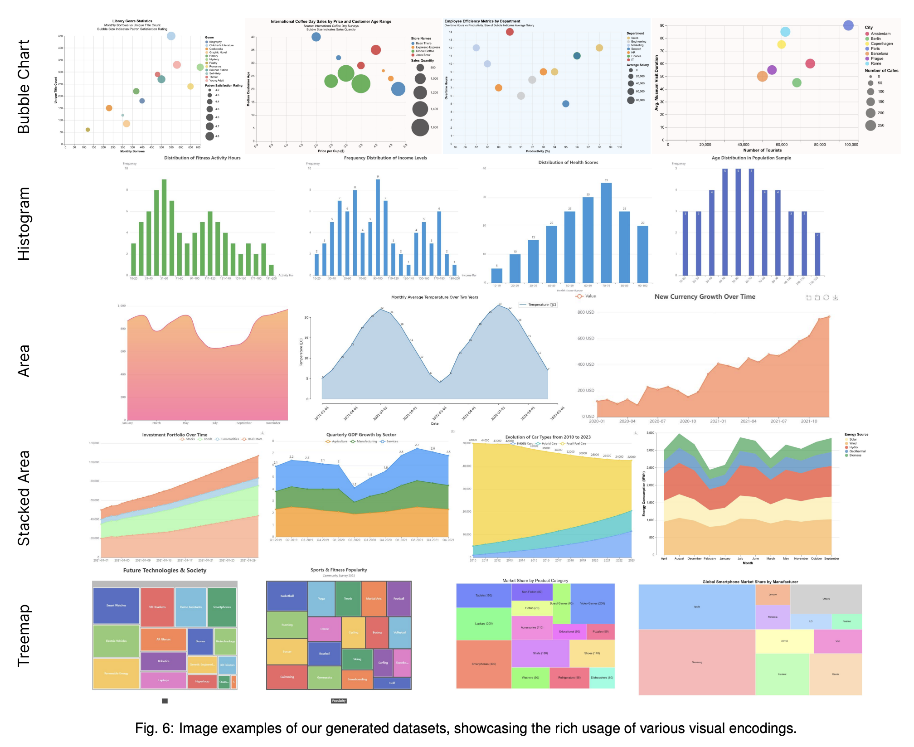

## ChartGeneration
This repository introduces a chart generation engine designed to create a dataset that includes a diverse range of real-world chart types and QA tasks, addressing the distribution bias found in existing datasets.
The below figure outlines our chart generation pipeline, which encompasses two phases: ***(1) Retrieval-Augmented Chart Generation*** and ***(2) Visualization-Referenced Encoding Augmentation***.


<details>
  <summary>Chart-task Space</summary>
  
  

</details>
<details>
  <summary>Data Gallery</summary>

  

  
</details>

## Contact
If you have any questions about this work, please email Xingchen Zeng at xingchen.zeng@outlook.com.

## Citation
```
@article{zeng2024vis,
  author={Zeng, Xingchen and Lin, Haichuan and Ye, Yilin and Zeng, Wei},
  journal={IEEE Transactions on Visualization and Computer Graphics}, 
  title={Advancing Multimodal Large Language Models in Chart Question Answering with Visualization-Referenced Instruction Tuning}, 
  year={2024},
  pages={1-11},
  doi={10.1109/TVCG.2024.3456159}
}
```
